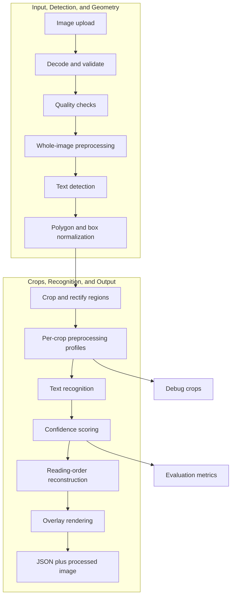

# OCR API Lab

OCR API Lab is a local-first OCR project for turning images into inspectable, explainable text extraction results. The goal is not just to call one OCR library and accept whatever comes back. The goal is to build a pipeline that detects text regions, extracts and normalizes crops, compares OCR strategies, renders visual overlays, and exposes the whole process through an API.

This is designed as both a learning project and a portfolio project: practical enough to run locally on an RTX 4070 Super, but modular enough to show real engineering judgment around computer vision, ML inference, evaluation, and API design.

**Current Phase**

Phase 0: architecture and project framing.

The project is currently being planned and documented before implementation begins. The next milestone is a small FastAPI service that accepts an image, runs a baseline OCR engine, and returns structured regions plus an annotated overlay.

**Pipeline**

**What This Project Will Demonstrate**

- Local OCR inference through Docker, eventually with GPU acceleration.
- A modular detector/recognizer architecture instead of a single black-box OCR call.
- Visual debugging: bounding boxes, polygons, crops, confidence scores, and timing data.
- Explainable preprocessing experiments such as deskewing, contrast normalization, thresholding, and crop rectification.
- Evaluation-driven development using repeatable test images and accuracy metrics.
- A clean API suitable for demos, benchmarking, and future UI work.

**Planned Technology**

- Python and FastAPI for the API.
- PaddleOCR as the first strong baseline OCR engine.
- OpenCV, Pillow, and NumPy for image processing and rendering.
- Pydantic for typed request/response models.
- Docker for local reproducibility.
- NVIDIA GPU support for local inference experiments.
- Optional later engines: docTR, EasyOCR, Tesseract, ONNX Runtime, and custom detection models.

**Project Roadmap**

The detailed learning and implementation roadmap lives in [docs/PLAN.md](docs/PLAN.md).
